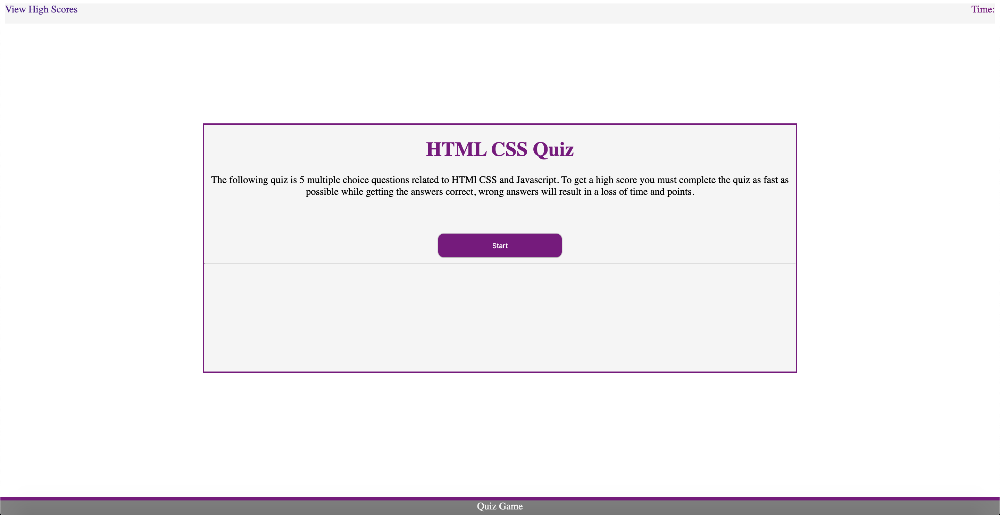

# MultipleChoiceQuiz
In this project I used my knowledge of HTML, CSS, JavaScript, and media queries to build a fully responsive multiple-choice quiz. It consists of five questions with four answers per question. Your score is the time left at the end of the quiz. You lose time and points  if you get an answer incorrect. Upon the completion of the quiz, your score is listed on the screen and you can input your initials. Upon clicking the submit button your score is published to the leader board. 
https://cfech.github.io/MultipleChoiceQuiz/

